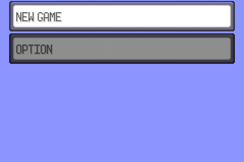
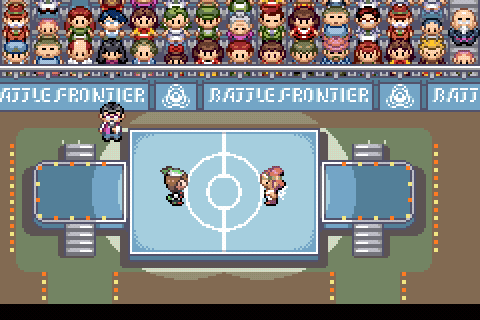
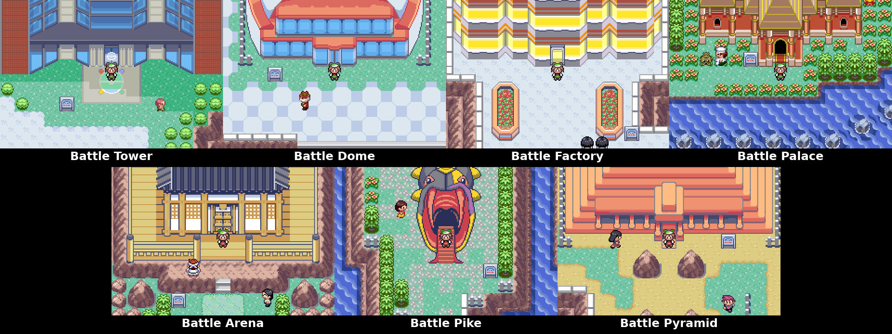
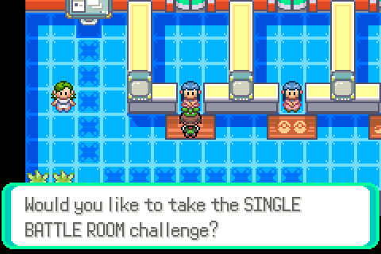

# Pokémon Emerald Battle Frontier

Start your Pokémon journey at the Battle Frontier. Build your team with the in-game Pokémon Lab Editor. Choose from a new "Hard" challenge mode, and pursue all seven Frontier Symbols.

<p align="center">
  
  
</p>



## Features

<table>
  <tr>
    <th width="50%">Pokémon Lab</th>
    <th width="50%">Hard mode</th>
  </tr>
  <tr>
    <td valign="top">
      
      <p>Create a Pokémon in an open party slot or refine an existing party member.</p>
      <ul>
        <li>Choose species, nature, ability, level, and held item</li>
        <li>Edit IVs and EVs with live stat previews and useful presets</li>
        <li>Select legal level-up, TM/HM, tutor, egg, and pre-evolution moves</li>
        <li>Validate the completed build before saving it</li>
      </ul>
    </td>
    <td valign="top">
      
      <p>Take a faster route to the Frontier's most demanding battles.</p>
      <ul>
        <li>Available at all seven Battle Frontier facilities</li>
        <li>Uses the strongest Frontier trainer pools</li>
        <li>Features earlier Frontier Brain encounters</li>
        <li>Tracks streaks, records, and progression separately from Normal mode</li>
      </ul>
    </td>
  </tr>
</table>

[Read the full list of features here.](FEATURES.md)

## Install and play

Releases contain a BPS patch and `checksums.txt`. They do not contain an
original or patched ROM. You must supply your own legally obtained copy of the
supported game.

### Supported base ROM

Use an unmodified English-language US release of **Pokémon Emerald Version**.
No other revision, language, headered file, or previously modified ROM is
supported.

```text
Required base ROM SHA-1: f3ae088181bf583e55daf962a92bb46f4f1d07b7
```

### Apply the BPS patch

1. Download `pokemon-emerald-battle-frontier.bps` and `checksums.txt` from the
   [latest release](https://github.com/Michelleeby/pokemon-emerald-battle-frontier/releases/latest).
2. Open [Rom Patcher JS](https://www.marcrobledo.com/RomPatcher.js/). Patching
   is performed locally in your browser.
3. Select your verified Pokémon Emerald ROM as the ROM file and the downloaded
   `.bps` file as the patch, then apply the patch.
4. Save the patched ROM and verify its SHA-1 before playing:

```text
Production ROM SHA-1: `94dd919efb13876a9bfa53a5787f3d294281f3a8`
```

The BPS format validates that the selected base ROM is correct. If patching
fails, verify the base ROM's SHA-1 and make sure it is clean and unmodified.

## Report a bug

Search the [existing issues](https://github.com/Michelleeby/pokemon-emerald-battle-frontier/issues)
before opening a new one. Include a clear description, the steps needed to
reproduce the problem, the facility and challenge mode involved, and your
emulator or hardware. Do not attach or link to ROM files.

## Build from source

This project uses the legacy `agbcc` toolchain. On Ubuntu or WSL2, install the
host dependencies, build the sibling `agbcc` checkout, install it into this
checkout, and run `make`:

```sh
sudo apt-get update
sudo apt-get install -y build-essential binutils-arm-none-eabi libpng-dev
cd ../agbcc
./build.sh
./install.sh ../pokeemerald
cd ../pokeemerald
make -j2
```

The resulting development build is `pokeemerald.gba`. See
[INSTALL.md](INSTALL.md) for repository setup, verification, and test commands.

## Credits

- [pret/pokeemerald](https://github.com/pret/pokeemerald) and its contributors
  for the Pokémon Emerald decompilation on which this project is based.
- [Rom Patcher JS](https://github.com/marcrobledo/RomPatcher.js) by Marc
  Robledo for BPS patch creation and browser-based patching.

## Legal notice

Pokémon Emerald Battle Frontier is an unofficial, unaffiliated fan project.
Pokémon and Pokémon Emerald are trademarks of Nintendo, Creatures Inc., and
GAME FREAK inc. This project is not endorsed by or affiliated with those
companies.

No original or patched Pokémon Emerald ROM files are provided by this project.
Releases contain only a patch and checksum information.
